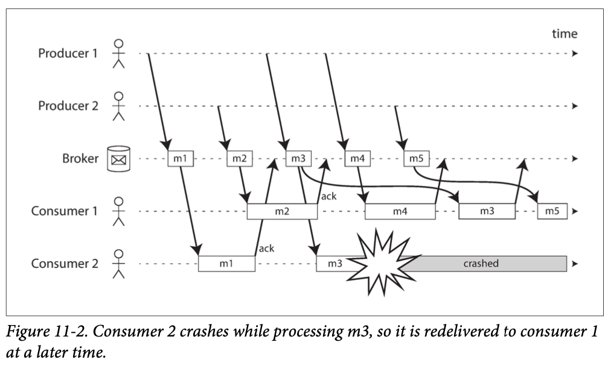
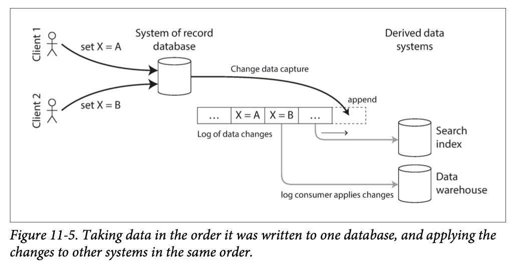

# Stream Processing

Batch Processing vs. Stream Processing

  0. delay: high vs. low
1. input is: bounded vs. unbounded
2. processed: in chunks vs. incrementally
3. input = file vs. event
    - event: a small, self-contained, ***immutable*** object containing the details of something that happened at some point in time
4. inputs are: written once vs. produced once by one producer
5. inputs are read by: multiple jobs vs. consumers
6. related inputs are identified by: filename vs. topic/stream

---

## 1. Transmitting Event Streams
How to connect producers and consumers?
- a file/database: possible but expensive polling for continual processing
- ➡️ Specialized tools: Notify consumers when new events appear! 

### Messaging Systems: Publish / Subscribe Model
A specialized tool for notifying consumers about new events

Unix pipe / TCP connection vs. Messaging System
- one sender - one recipient vs. multiple producer nodes - multiple consumer nodes

Different approaches addressing
- How to deal with fallen behind consumers?
    1. drop messages
    2. buffer messages in a queue
        - what happens as queue grows?
        - if the queue no longer fits in memory, crash? or spill to disk?
        - how disk access affects the performance?
    3. apply backpressure(hey producer stop): Unix pipes / TCP connection
- Durability: How to deal with node crashes -- lost messages?

How to achieve reliability like in batch processing?: p.476

### 1) Direct Messaging from Producers to Consumers
Used in
- financial industry stock market feeds: UDP multicast
    - unreliable UDP: producer keeping track of packets it has sent
- ZeroMQ, nanomsg: TCP / IP multicast
- StatsD, Brubeck: UDP for collecting metrics and monitoring
- Webhooks
    - Consumer exposes a service on the network, producer makes direct HTTP / RPC request to push messages

Aware of MESSAGE LOSS
- limited fault tolerance: producers and consumers are always online

Different approaches addressing ~~
- drop messages
- when consumers crash messages can be lost
    - some implements retry in producers: when producers crash 😇

### 2) Message Brokers
Send messages via a `message broker`
- optimized for handling message streams
- runs as a server, with producers and consumers connecting to it as clients

Different approaches addressing ~~
- (un)bounded queuing ➡️ ***asynchronous*** consumers
    - producer only waits for the broker to buffer the message
    - consumers will process the message sometime...!
- the issue of durability moves to the broker instead

### 2-1) AMQP / JMS Message Brokers
#### Message Brokers vs. Databases
- message automatically deleted (➡️ assume small working set) vs. keep data until explicitly deleted
- how client select data?
    - subscribe to a subset of topics matching some pattern vs. secondary indexes + etc.
- No supported arbitrary queries vs. query supported
- keep clients updated vs. clients result may be outdated

Examples
- RabbitMQ, ActiveMQ, HornetQ, Qpid, ...
#### Multiple Consumers
Multiple consumers reading messages in the same topic

1. Load Balancing
2. Fan-out
3. Combined: two separate groups of consumers each subscribe to a topic (fan-out), within each group only once of the nodes receives each message (load balancing)

#### Acknowledgments and Redelivery
`Acknowledgement`: to ensure the message is not lost
- client must explicitly tell the broker it has finished processing a message so that the broker can remove it from the queue

Redelivery: when not acknowledged, broker redelivers the message to another consumer
- may be fully processed but lost acknlowedgement: atomic commit protocol needed

    

Redelivery combined with load balancing ➡️ ordering of messages not guaranteed
- Don't use load balancing if ordering of messages is required

### 2-2) Log-Based Message Brokers
message brokers: a new client can only read messages sent after it was registered 🤔
- log-based message brokers:️ apply durable storage approach of databases 👍

#### Using logs for message storage
`log`: ***append-only*** sequence of records on ***disk***
- producer: sends a message by appending it to the end of the log
- consumer:  receives messages by reading the log sequentially 
  
Partitioned Log 
- ➡️ scale to higher throughput than a single disk can offer 
- `topic`: a group of partitions all carrying messages of the same type
- `offset` within partition
    - the broker assigns *monotonically increasing* sequence number to every message within each partition
    - ordering guaranteed within partition / not guaranteed across partitions
        - ➡️ ⭐️ all messages need to be ordered should be routed to the same partition ⭐️

High throughput by partitioning, high fault tolerance by replicating messages

Examples 
- Apache Kafka 🌟, Amazon Kinesis Streams, ...

#### Log-based vs. AMQP/JMS
Fan-out: easy~
- each consumer independently read the log without affecting each other
    - reading message does not delete log

Load balancing across a group of consumers
- each node in the consumer group is assigned *entire* partitions: 
    - especially when each consumer is assigned a single log partition: single-threaded manner processing 
-️ 🤔
    - limited parallelism: \# nodes <= \# partitions
    - sequential processing ➡️ if a single message is slow to process, it holds up the processing of subsequent messages in that partition 

Conclusion
- AMQP / JMS when
    - messages expensive to process 
    - & parallelize processing on a message-by-message basis 
    - & message ordering not important
- log-based when
    - each message is fast to process
    - & message ordering important

#### Consumer offsets
Each consumer knows which messages have been processed
- ➡️ No need for the broker to track acknowledgements for every single message
- ➡️ Increased throughput

Very similar to `log sequence number`
- message broker behaves like a leader database and the consumer like a follower

What if a consumer failed with message consumed but offset not recorded? ➡️ later in the chapter...

#### Disk space usage
constant throughput of a log regardless of the buffer size
- *every* message written to *disk* anyway
- ≠ AMQP/JMS: written in-memory, spilled to disk as the queue grows

Large-size buffering
- bounded-size buffering: but really large(disk-size)

### When a consumer falls so far behind
Broker drop message if the buffer grows larger than the disk size
- only that consumer is affected: other consumers not disrupted
    - operational advantage: experimentally consume production log for development, testing, etc.

When a consumer crashes / shut down
- it stops consuming resources: only its consumer offset remains
- ≠ AMQP/JMS: should delete queues whose consumers have been shut down 

#### Replaying old messages
AMQP/JMS message brokers: consuming message is destructive

Log-based message brokers: consuming message ≈ reading from a file
- side effect of consuming log: consumer offset moving forward: under consumer's control ➡️ more like batch processing
    - separate derived data from input data
    - repeatable processing: start a copy of a consumer with earlier offset, reprocess messages!

---

## 2. Databases and Streams
Apply stream & messaging method to databases
- How to sync heterogeneous data systems?

### Keeping Systems in Sync
1. `batch process`: take a full copy of a database, transform it, bulk load it into the data warehouse
   - problem: too slow 🙁
2. `dual writes`: application code explicitly writes to each of the systems when data changes
    - faster than `batch process`
    - problems
    1. race condition
    2. atomic commit problem: some writes fail while others succeed
        - expensive to solve
    - what if there is a ***single leader***...?? ➡️ CDC

### 1) Change Data Capture
Database's replication logs: not a public API
- no documented way of getting log of changes ➡️ hard to propagate changes to different storage technologies (ex. search index, chache, data warehouse)

`change data capture(CDC)`: observe all data changes written to a database and extract them in a form in which they can be *replicated* to other systems
- changes are made as a stream: 🎉
    

#### Implementing CDC
CDC: ensure all changes made to the system of record are also reflected in the derived data systems so that the derived systems have an accurate copy of the data
- makes ⭐️one database⭐️ the leader(=source) and turns the others into followers(=derived)
- use log-based message broker
    - ordering of messages required
    - more robust approach compared to database triggers
    - ➡️ asynchronous
        - 👍 adding a slow consumer does not disrupt the system
        - 👎 replication lag apply
- examples: ... Debezium ... Kafka Connect

How to implement?
1. Initial snapshot
    - keeping entire database log history 🤢🤮 ➡️ start with a consistent database snapshot
        - snapshot must correspond to a known position or offset in the change log
        - apply changes after the offset
    - snapshot process required for every new derived data system 🙁
        - BUT relational databases have no other choices T.T 
2. Log compaction
    - good alternative for `initial snapshot`
        - new consumer starts with offset 0 of the log-compacted topic
        - the log is guaranteed to contain the most recent value for every key in the database
    - log compaction algorithm applied
    - key-value datastores
    - Supported by Apache Kafka

#### API supports for change streams
Databases beginning to support change streams as a first-class interface

Kafka Connect: integrate CDC tools for a wide range of database systems with Kafka

### 2) Event Sourcing

Developed in the domain-driven design (DDD) community
- DDD: let's enforce a stricter alignment between software and business!

Concept
- Store all changes to the *application state* as a log of change events 
- event sourcing vs. CDC
  - CDC
      - uses the database in a *mutable* way (updating and deleting records)
      - log of changes extracted from the database *at a low level* (e.g. parsing replication log)
      - application: unaware of CDC
  - event sourcing
      - built on the basis of *immutable* `events`
      - `event store`: *append-only*
      - `events`: reflect things that happened *at the application level*

Why use it?
- Powerful technique for data modeling: more meaningful records
- helps with evolve applications (p. 461)

How use it?
- store *all* events (p. 463) and reprocess the full event log whenever required
  - reprocessing must be deterministic
  - snapshots may be used to optimize performance
- vs. CDC
  - =: replaying event log reconstructs the current state of the system
  - ≠: log compaction can't be used

core concept: `commands` and `events`
- a request from a user: `command`
- successful validation: `event` == immutable, durable *fact*
  - How to validate?
    1. synchronous
    2. asynchronous: split command into two events
      - tentative event
      - separately confirmed event

ref.
- https://medium.com/swlh/event-sourcing-as-a-ddd-pattern-fea6de35fcca
- https://www.youtube.com/watch?v=AUj4M-st3ic
